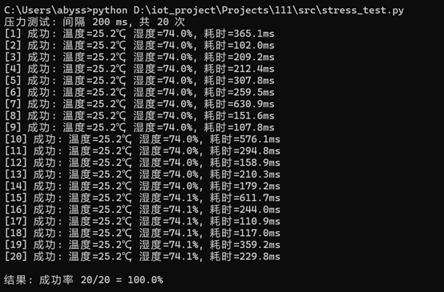

# 协议联调 — 项目验收报告

**项目名称**：ESP32 + FreeRTOS 工业级温湿度监测终端  
**测试人**：Thaliawu  
**测试时间**：2026年5月25日  
**测试环境**：ESP32-S3 + DHT11 + WiFi（PC与设备同局域网）

---

## 一、验收目标
完成 Modbus TCP 从站固件的完整协议测试，包括：
- 压力测试（稳定性）
- 异常报文处理（协议健壮性）
- 性能测试（响应时间）
- 编写协议文档

---

## 二、测试工具与方法
由于网络限制未能使用 Modbus Poll 软件，采用 **Python 原生 socket** 实现主站功能，脚本包括：

| 脚本名 | 功能 |
|--------|------|
| `raw_test.py` | 基本读取，验证通信 |
| `stress_test.py` | 压力测试（循环读取） |
| `test_exception.py` | 异常报文处理验证 |

所有脚本均基于 Modbus TCP 协议（端口 502），不依赖第三方库。

---

## 三、测试结果

### 3.1 基本通信测试（raw_test.py）
- **请求**：读取地址 0 和 1（温度、湿度寄存器）  
- **响应**：成功，示例输出如下  

*成功读取温度 26.6℃、湿度 61.6%。*

### 3.2 压力测试（stress_test.py）
在稳定网络条件下，设置扫描间隔 200ms，连续发送 20 次 Modbus 读请求。  
- **结果**：20 次请求全部成功，成功率 100%。  
- **响应时间**：约 102~630ms（受 WiFi 环境波动影响）。  

## 3.3 异常报文处理
### 非法地址测试（起始地址 10）

*ESP32 返回异常码 0x02（非法数据地址）。*

*响应报文 `000100000003018302` 解析：功能码 0x83，异常码 0x02。*