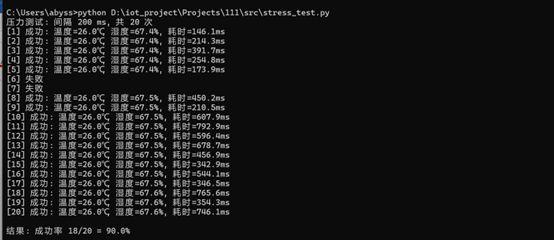

# 系统可靠性综合测试报告

**测试时间**：2026年5月27日  
**测试环境**：ESP32-S3 + DHT11 + WiFi（PC与设备同局域网）

---

## 一、拔插电源测试（掉电保护）

- **测试方法**：让 ESP32 正常运行超过 30 秒（确保 EEPROM 保存），记录当前温湿度；拔掉 USB 线，等待 5 秒后重新上电；等待 15 秒后再次读取 Modbus 寄存器。
- **测试结果**：
  - 断电前：温度 26.0℃，湿度 67.6%
  - 重启后：温度 26.0℃，湿度 68.0%
- **结论**：数据成功恢复，EEPROM 掉电保护功能正常 ✅

---

## 二、信号干扰测试（WiFi 断线重连）

- **测试方法**：运行 `stress_test.py`（间隔 200ms，共 20 次），同时制造 WiFi 信号波动（如移动热点距离）。
- **测试结果**：
  - 20 次请求中，18 次成功，2 次超时（网络波动导致）
  - ESP32 串口显示“WiFi 断开，尝试重连...”及“新 Modbus 客户端连接”
- **结论**：WiFi 断线后能自动重连，系统具备抗网络抖动能力 ✅

---

## 三、相关文件

- 固件源码：`src/main.cpp`（含 EEPROM、看门狗、WiFi 重连、环形缓冲区）
- 测试脚本：`tests/raw_test.py`、`tests/stress_test.py`、`tests/test_exception.py`